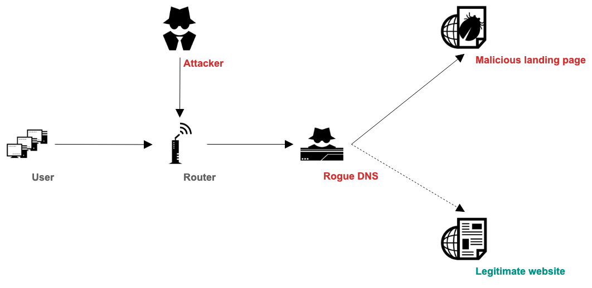

# Rogue one

[](https://badge.fury.io/rb/rogue_one)
[](https://github.com/ninoseki/rogue_one/actions/workflows/test.yaml)
[](https://www.codefactor.io/repository/github/ninoseki/rogue_one)
[](https://coveralls.io/github/ninoseki/rogue_one?branch=master)

A PoC tool for analyzing a rogue DNS server.

This tool could be used for checking maliciousness of a DNS server and extracting landing pages.

## How it works



IPv4 space is vast. But an attacker could secure a few numbers of IP addresses for landing pages.
It means you can (probably) find malicious landing pages by using the following methods.

- Resolving a bunch of domains by using a DNS server.
- Finding frequent IPv4s from the resolutions. They might be landing pages.
- If a DNS server has landing pages, it might be a rogue one.

## Requirements

- Ruby 3.x / Ruby 2.7+

## Installation

```bash
gem install rogue_one
```

## Usage

```bash
$ rogue_one
Commands:
  rogue_one help [COMMAND]       # Describe available commands or one specific command
  rogue_one report [DNS_SERVER]  # Show a report of a given DNS server

$ rogue_one help report
Usage:
  rogue_one report [DNS_SERVER]

Options:
  [--custom-list=CUSTOM_LIST]    # A path to a custom list of domains
  [--default-list=DEFAULT_LIST]  # A default list of top 100 domains (Alexa or Fortune)
                                 # Default: alexa
  [--record-type=RECORD_TYPE]    # A type of the DNS resource to check
                                 # Default: A
  [--threshold=N]                # Threshold value for determining malicious or not
  [--verbose], [--no-verbose]

Show a report of a given DNS server

$ rogue_one report 1.1.1.1
{
  "verdict": "benign one",
  "landing_pages": [

  ]
}

$ rogue_one report 1.53.252.215
{
  "verdict": "rogue one",
  "landing_pages": [
    "1.171.168.19",
    "1.171.170.228",
    "61.230.102.66"
  ]
}

$ rogue_one report 171.244.3.111 --custom-list tmp/roaming.yml
{
  "verdict": "rogue one",
  "landing_pages": [
    "154.223.53.53",
    "58.82.243.9"
  ]
}
# Note: a custom list should be an array of domains in a YAML file.
```

| Key           | Desc.                                                                    |
|---------------|--------------------------------------------------------------------------|
| verdict       | A detection result (`rogue one` or `benign one`)                         |
| landing_pages | An array of IP of landing pages                                          |
| results       | DNS resolution results (only available if --verbose option is specified) |

## Notes

- This is just a PoC tool. I cannot guarantee the results with high confidence at the moment.

## License

The gem is available as open source under the terms of the [MIT License](https://opensource.org/licenses/MIT).
